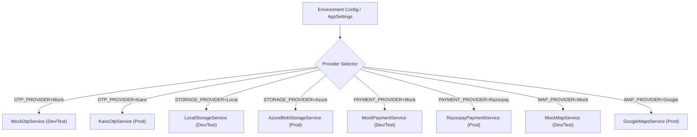

# SuperApp Provider Migration & Switching Guide

This document outlines the procedure for transitioning external third-party service providers from **Development Mocks** to **Live Production Vendors** with **Zero Business-Logic Rewrites**.

---

## 1. Provider Switching Architecture

All external services are registered via dependency injection in [`SuperApp.API/Program.cs`](file:///D:/HTTPclient1/SuperApp.API/Program.cs) and resolved dynamically through environment variables or configuration keys:



---

## 2. Service Migration Runbooks

### 2.1 SMS / OTP Provider (`IOtpService`)
- **Interface**: [`IOtpService.cs`](file:///D:/HTTPclient1/SuperApp.API/Services/IOtpService.cs)
  - `Task<bool> SendOtpAsync(string mobileNumber, string otpCode, string purpose);`
  - `Task<bool> ValidateOtpAsync(string mobileNumber, string otpCode, string purpose);`
- **Development Provider**: `MockOtpService` (Universal code `123456`, persists audit in `OtpRequests` table).
- **Production Providers**: `Karix`, `Twilio`, `Gupshup`.
- **Environment Variables**:
  ```bash
  OTP_PROVIDER=Karix
  OTP_API_URL=https://api.karix.io/send-sms
  OTP_API_KEY=your_api_key_here
  OTP_SENDER_ID=SUPAPP
  OTP_DLT_ENTITY_ID=1101...
  OTP_DLT_TEMPLATE_ID=1107...
  ```
- **Switching Procedure**:
  1. Set `OTP_PROVIDER=Karix` and configure the corresponding credentials in your deployment environment.
  2. Restart the API container/service.
  3. Attempt login with a real mobile number. Confirm SMS receipt and verify token generation.
- **Rollback Procedure**:
  - Revert `OTP_PROVIDER=Mock`. The system instantly accepts `123456` with zero code downtime.

---

### 2.2 Maps & Geolocation (`IMapService`)
- **Interface**: [`IMapService.cs`](file:///D:/HTTPclient1/SuperApp.API/Services/IMapService.cs)
  - `Task<double> CalculateDistanceKmAsync(double lat1, double lon1, double lat2, double lon2);`
  - `Task<int> EstimateDurationMinutesAsync(double distanceKm);`
  - `Task<string> ReverseGeocodeAsync(double latitude, double longitude);`
- **Development Provider**: `MockMapService` (Computes Haversine spherical distance multiplied by urban road curvature factor 1.25x; calculates realistic city ETA).
- **Production Providers**: `Google`, `Mapbox`.
- **Environment Variables**:
  ```bash
  MAP_PROVIDER=Google
  MAP_API_KEY=AIzaSy...
  ```
- **Switching Procedure**:
  1. Set `MAP_PROVIDER=Google` and provide `MAP_API_KEY` with Geocoding and Directions APIs enabled in Google Cloud Console.
  2. Restart service.
  3. Execute `POST /api/rides/estimate` with coordinates; verify accurate turn-by-turn road route distance.
- **Rollback Procedure**:
  - Revert `MAP_PROVIDER=Mock`. The backend returns mathematical estimation instantly.

---

### 2.3 Payment Gateway (`IPaymentService`)
- **Interface**: [`IPaymentService.cs`](file:///D:/HTTPclient1/SuperApp.API/Services/IPaymentService.cs)
  - `Task<PaymentOrderResponse> CreatePaymentOrderAsync(PaymentOrderRequest request);`
  - `Task<PaymentVerificationResponse> VerifyPaymentAsync(PaymentVerificationRequest request);`
- **Development Provider**: `MockPaymentService` (Generates simulated `mock_order_...` and `mock_txn_...` identifiers, auto-validates signatures).
- **Production Providers**: `Razorpay`, `Cashfree`.
- **Environment Variables**:
  ```bash
  PAYMENT_PROVIDER=Razorpay
  PAYMENT_KEY=rzp_live_...
  PAYMENT_SECRET=your_secret_here
  PAYMENT_WEBHOOK_SECRET=your_webhook_secret_here
  ```
- **Switching Procedure**:
  1. Set `PAYMENT_PROVIDER=Razorpay` and input live API credentials.
  2. Configure Razorpay webhook callback to `https://api.superapp.com/api/payments/webhook`.
  3. Initiate a test ₹1 transaction. Verify status transitions to `PAID` in the `Payments` table.
- **Rollback Procedure**:
  - Revert `PAYMENT_PROVIDER=Mock`.

---

### 2.4 File & Asset Storage (`IStorageService`)
- **Interface**: [`IStorageService.cs`](file:///D:/HTTPclient1/SuperApp.API/Services/IStorageService.cs)
  - `Task<string> UploadFileAsync(Stream fileStream, string fileName, string contentType, string folder);`
  - `Task<bool> DeleteFileAsync(string fileUrl);`
  - `string GetFileUrl(string relativePath);`
- **Development Provider**: `LocalStorageService` (Writes directly to `wwwroot/uploads/{folder}/`).
- **Production Provider**: `AzureBlobStorageService` (Microsoft Azure Blob Storage).
- **Environment Variables**:
  ```bash
  STORAGE_PROVIDER=Azure
  STORAGE_CONNECTION_STRING=DefaultEndpointsProtocol=https;AccountName=...;AccountKey=...;EndpointSuffix=core.windows.net
  STORAGE_CONTAINER_NAME=superapp-assets
  ```
- **Switching Procedure**:
  1. Set `STORAGE_PROVIDER=Azure` and provide valid Azure Storage connection string.
  2. Upload a dish photo or marketplace item via the web portal or app.
  3. Verify the blob URL points to the Azure CDN or blob endpoint.
  *(Note: If the Azure connection string is missing or invalid, `AzureBlobStorageService` automatically fails safe to local disk storage without dropping the upload).*
- **Rollback Procedure**:
  - Revert `STORAGE_PROVIDER=Local`.

---

### 2.5 Push Notifications (`INotificationService`)
- **Interface**: [`INotificationService.cs`](file:///D:/HTTPclient1/SuperApp.API/Services/INotificationService.cs)
  - `Task<bool> SendPushNotificationAsync(long userId, string title, string body, Dictionary<string, string>? data);`
- **Development Provider**: `MockNotificationService` (Logs notifications and persists them directly into the SQL Server `Notifications` table so the Flutter in-app notification center works out of the box).
- **Production Provider**: Firebase Cloud Messaging (`FCM`).
- **Environment Variables**:
  ```bash
  NOTIFICATION_PROVIDER=Firebase
  FIREBASE_PROJECT_ID=superapp-prod
  FIREBASE_CREDENTIALS_PATH=/app/secrets/firebase-service-account.json
  ```
- **Switching Procedure**:
  1. Deploy Google Service Account JSON to a secure mount on the host.
  2. Set `NOTIFICATION_PROVIDER=Firebase` and configure the path.
  3. Send an order update from the Restaurant Vendor panel; verify background notification arrival on device.
- **Rollback Procedure**:
  - Revert `NOTIFICATION_PROVIDER=Mock`.

---

## 3. Zero-Rewrite Validation Checklist

When migrating any provider, verify:
- [ ] Business logic controllers (`FoodOrdersController`, `RidesController`, `AuthController`) were **NOT modified**.
- [ ] Entity Framework DbContext and database schema were **NOT altered**.
- [ ] Switch was executed solely through environment variables / configuration files.
- [ ] Integration test suite passes cleanly before and after the switch.
